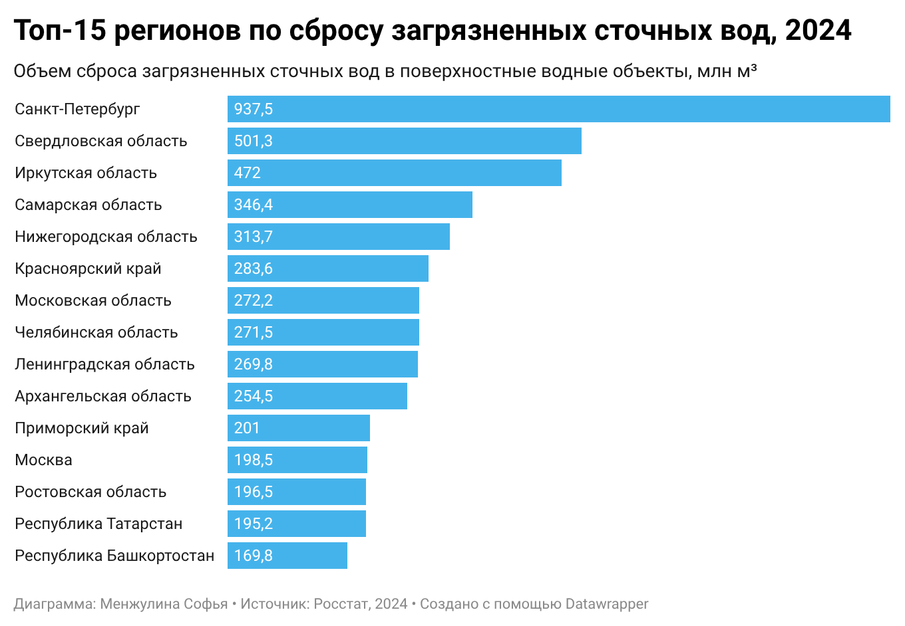
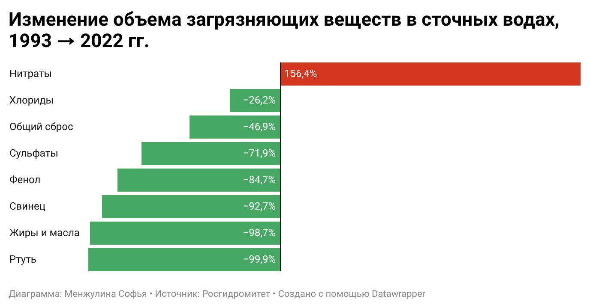
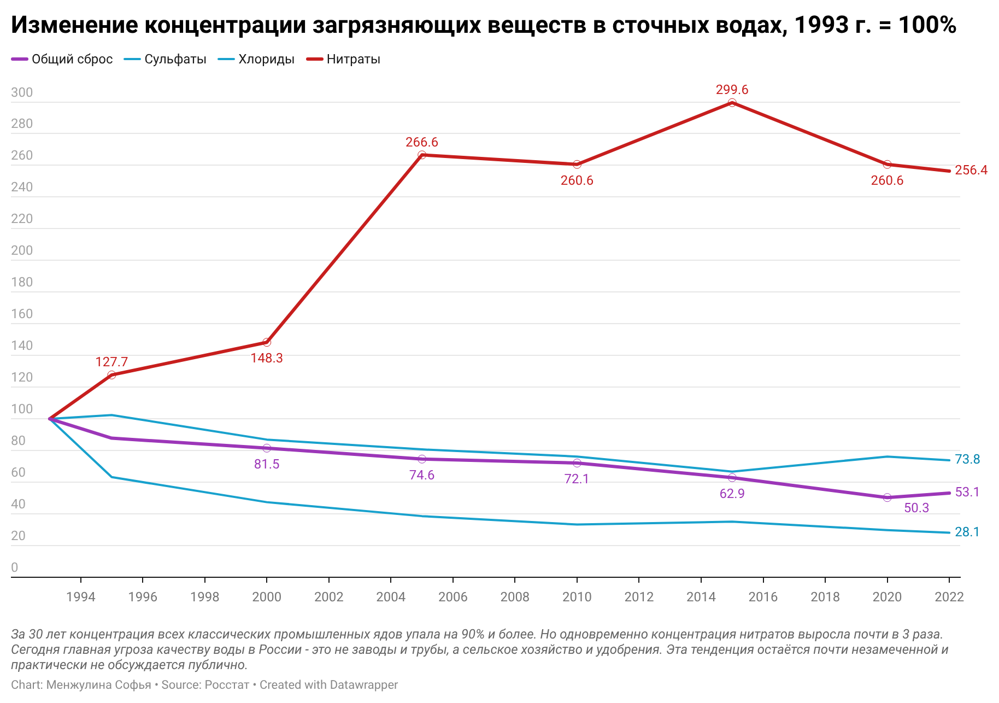
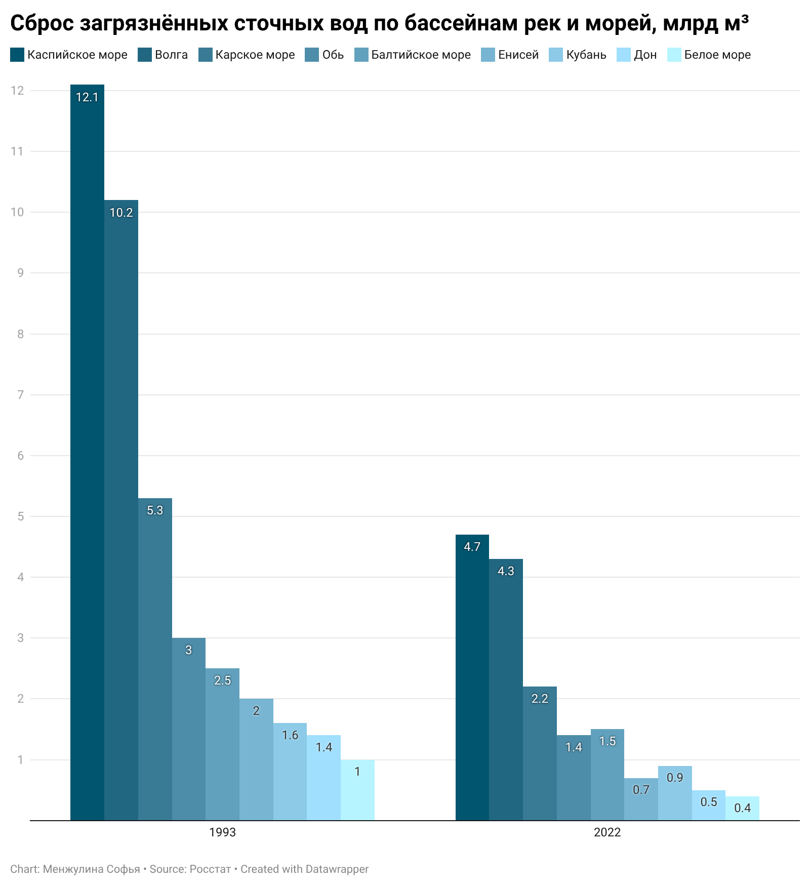
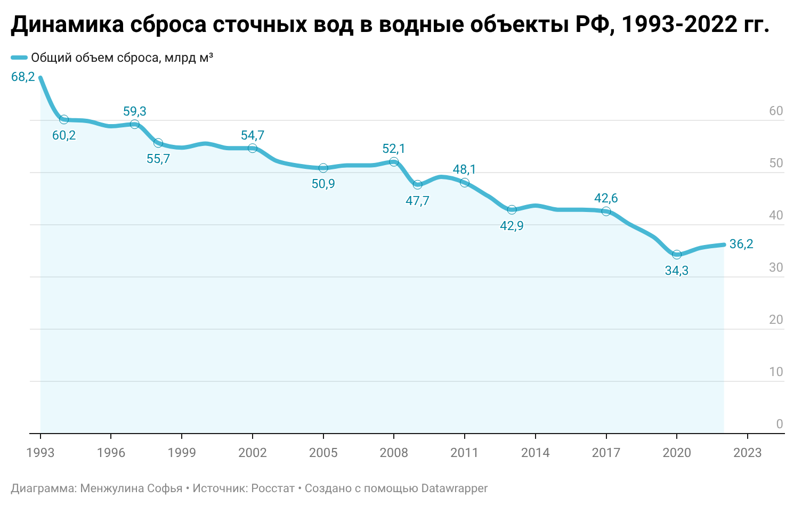
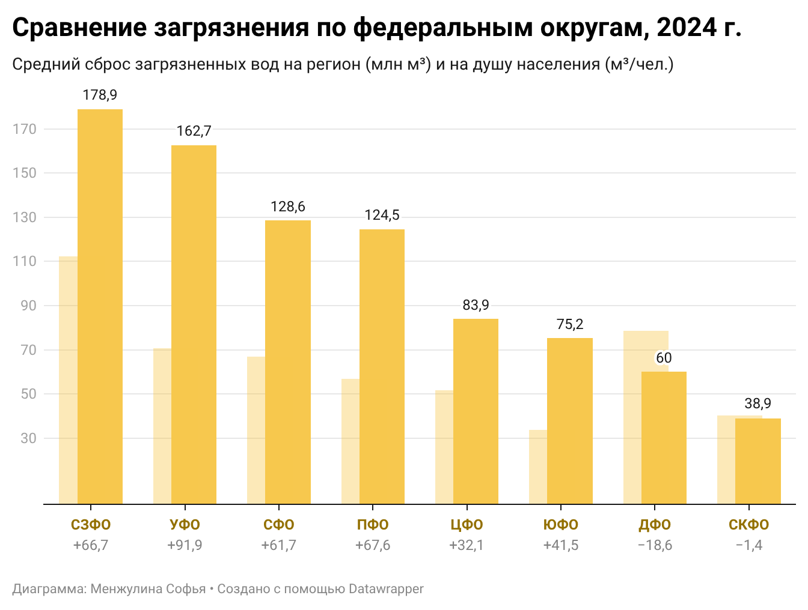
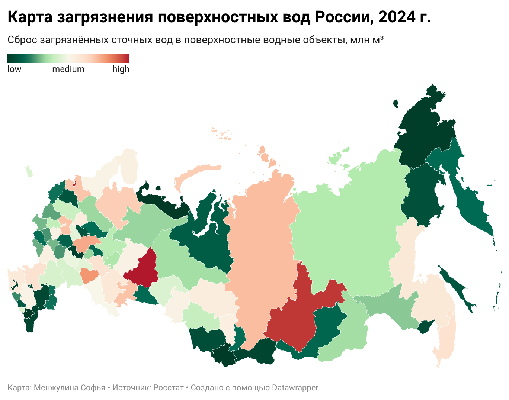
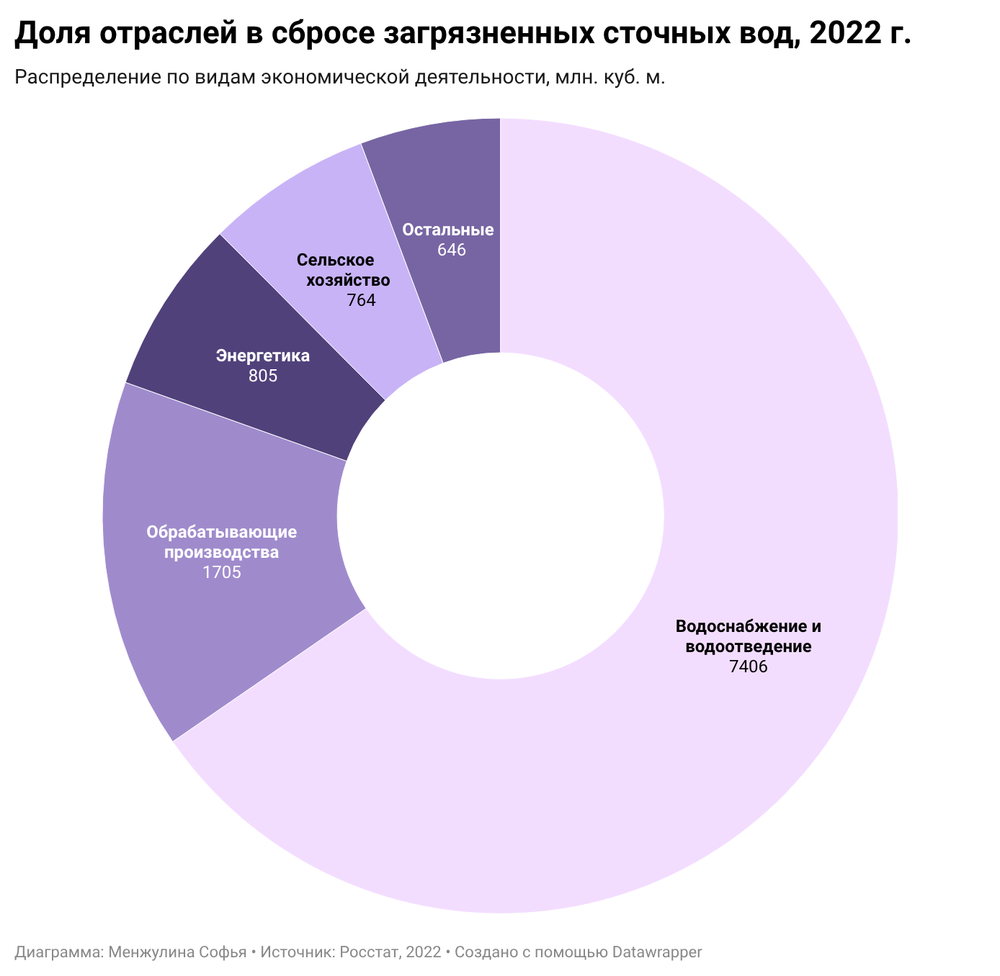

# Загрязнение поверхностных вод России: где вода опаснее всего

**Автор:** Менжулина Софья

## Синопсис

Качество воды в российских водоемах сильно различается от региона к региону. Где-то вода остается относительно чистой, а где-то концентрации вредных веществ систематически превышают допустимые нормы. При этом большинство людей даже не задумываются об этой проблеме – данные мониторинга разбросаны по PDF-отчетам и статистическим сборникам, и разобраться в них без подготовки бывает сложно.

В этом проекте я собрала данные из нескольких государственных источников, очистила и объединила их в единый датасет, провела анализ и построила визуализации. Цель — показать наглядко и объяснить простым языком, в каких регионах ситуация с водой хуже всего, какие загрязнители наиболее опасны, какие реки страдают сильнее и есть ли тенденция к улучшению.

Главный вывод, к которому я пришла: **доступ к чистой воде в России во многом зависит от того, где ты живёшь.** В некоторых регионах почти 100% сточных вод сбрасываются без очистки, а нитраты – единственный загрязнитель, количество которого выросло за последние 30 лет (+156%).

## Актуальность

Вода — ключевой ресурс для жизни и здоровья человека. Поверхностные водоемы (реки, озера, водохранилища) являются основным источником питьевого водоснабжения, средой обитания рыб и других организмов, используются в сельском хозяйстве и промышленности, например, для орошения земель, а также поддерживают биологическое разнообразие экосистем. 

Несмотря на это, проблема загрязнения поверхностных вод остается малозаметной для широкой аудитории, но тема важна именно сейчас, так как:
- Данные о загрязнении воды существуют, но они разрозненны и малодоступны для обычного человека. Росстат публикует таблицы в Excel, Росгидромет – в PDF, и все это на разных сайтах и в разных форматах.
- Межрегиональные сравнения почти не проводятся в понятном виде. Человек из Челябинска не может легко узнать, насколько его вода хуже или лучше, чем в Краснодаре.
- Проблема остается «невидимой»: по данным Google Trends и Яндекс.Подбора слов, люди ищут «качество воды» и «загрязнение воды» в общих формулировках, но почти не обращаются к конкретным данным мониторинга.

Данный проект призван систематизировать и визуализировать открытые данные о качестве поверхностных вод, сделав их понятными и доступными для анализа.

## Исследовательские вопросы

В ходе работы я искала ответы на следующие вопросы:

1. **В каких регионах России фиксируется наибольший уровень загрязнения поверхностных вод?** – где сбрасывают больше всего грязной воды, и как это выглядит на душу населения?
2. **Какие загрязняющие вещества представляют наибольшую угрозу?** – что именно попадает в воду и как изменился состав загрязнителей за 30 лет?
3. **Какие реки и водные бассейны страдают сильнее всего?** – куда стекает основная масса загрязнений?
4. **Становится ли вода чище или грязнее?** – есть ли положительные тенденции за последние десятилетия?
5. **Существуют ли географические кластеры загрязнения?** – можно ли выделить целые части страны с похожими проблемами?
6. **Как тип региона влияет на загрязнение воды?** – что загрязняет воду больше: заводы, фермы или города?

## Данные

### Откуда я брала данные

Все данные в проекте взяты из открытых государственных источников. Я использовала 6 датасетов:

**Росстат – [«Основные показатели охраны окружающей среды»](https://rosstat.gov.ru/storage/mediabank/oxr_bul_2025.pdf) (2025).** PDF-документ с актуальными данными за 2024 год. Отсюда я взяла два датасета:
- Забор воды для использования, потери воды и сброс сточных вод в 2024 г. — таблица по всем субъектам РФ, разбитым по федеральным округам. Из нее я использовала: объем забора воды, общий сброс сточных вод, объем загрязненных сбросов и долю загрязненных вод по каждому из 85 регионов. Это основной датасет проекта.
- Выбросы наиболее распространённых загрязняющих атмосферу веществ, отходящих от стационарных источников, в 2024 г. — использовала как дополнительный контекст для понимания общей экологической нагрузки по регионам.

**Росстат – [«Охрана окружающей среды»](https://rosstat.gov.ru/folder/11194).** Отсюда взяты три таблицы с историческими данными:
- Поступление загрязняющих веществ со сточными водами в водоёмы по РФ (1993–2022) – содержит данные по конкретным веществам: сульфаты, хлориды, нитраты, жиры и масла, фенол, свинец, ртуть. Именно эта таблица позволила проследить, как менялся состав загрязнителей за 30 лет.
- Объём сброса загрязнённых сточных вод по бассейнам отдельных рек и морей РФ (1993–2022) – данные по бассейнам Волги, Оби, Енисея, Дона, Кубани, Балтийского, Каспийского, Карского и Белого морей. Позволила понять, какие реки страдают сильнее всего.
- Сброс загрязнённых сточных вод в поверхностные водные объекты по видам экономической деятельности по РФ (2017–2022) – разбивка по отраслям: водоснабжение, обрабатывающие производства, энергетика, сельское хозяйство, добыча полезных ископаемых. Данные показали, что на самом деле является главным загрязнителем.

**FinExpertiza – [исследование загрязнения рек (2022)](https://finexpertiza.ru/press-service/researches/2022/zagryazn-rek/).** Аналитическое исследование, основанное на данных Росгидромета. Содержит готовый рейтинг регионов по числу случаев высокого и экстремально высокого загрязнения водных объектов за I полугодие 2022 года. Этот датасет дополняет картину: если данные Росстата показывают объем сбросов, то данные FinExpertiza говорят о последствиях (сколько раз зафиксировали опасный уровень загрязнения в водоемах).

### Как я работала с данными

Все данные собраны в одной Google-таблице с несколькими листами (10 всего). Вот что я делала на каждом этапе:

**Сбор.** Данные с сайтов и файлов Excel я автоматически перенесла в Google Sheets. Импорт из PDF не очень удачно работал с таблицами Росстата – числа слипались, строки путалисья, поэтому ручной перенос в этом случае оказался надежнее.

**Структура.** Так, "сырые" данные хранятся на отдельных листах с пометкой raw:
- `raw_regions` – данные по 85 регионам (забор воды, сброс, загрязненные сбросы, доля загрязнённых) из бюллетеня Росстата
- `raw_pollution` – случаи высокого и экстремально высокого загрязнения по 47 регионам из исследования FinExpertiza
- `raw_pollutants` – загрязняющие вещества по годам (1993–2022) из раздела Росстата
- `raw_basins` – сбросы по бассейнам рек и морей (1993–2022) из раздела Росстата
- `raw_industry` – сбросы по видам экономической деятельности (2017–2022) из раздела Росстата

Очищенные и подготовленные для удобной работы данные `raw_regions` хранятся на листе `clean_regions`.

**Очистка.** При переносе данных в таблицу некоторые числа (например, 2793.4) Google Sheets воспринимал как даты. Нужно было менять формат столбцов и приводить их к "числовому". Также я стандартизировала названия регионов (привела все варианты написания к единому виду), проверила дубликаты через формулу COUNTIF (дубликатов не нашлось) и убедилась, что все данные распознаются верно (числа как числа, даты, как даты, а не как текст). Нулевые значения у Ненецкого АО и Чеченской Республики оставила как есть, так как это реальное отсутствие загрязненных сбросов, а не пропуск в данных.

**Нормализация.** Для корректного сравнения регионов я добавила столбец с численностью населения каждого субъекта и рассчитала показатель «сброс на душу населения» по формуле: сброс в млн м³ / население в тыс. чел. × 1000. Без этого Санкт-Петербург с населением 5.6 млн выглядит в разы «грязнее» Архангельской области, хотя на каждого жителя Архангельской приходится в 16 раз больше загрязненных стоков.

**Данные проекта:** [`data/`](data/)

## Анализ и результаты

### Описательная статистика

Прежде чем искать закономерности, я посчитала базовые характеристики датасета. В выборке 85 регионов. Суммарный сброс загрязненных сточных вод по России – около 9017 млн м³ в год. Среднее значение по регионам – 106.1 млн м³, но медиана гораздо ниже – 65.5 млн м³. Такой разрыв между средним и медианой говорит о том, что распределение сильно неравномерное: есть несколько регионов-«гигантов», которые тянут среднее вверх, а большинство сбрасывают значительно меньше. Максимум – у Санкт-Петербурга (937.5 млн м³), минимум – у Ненецкого АО и Чеченской Республики (0).

Результаты описательной статистики можно найти в таблице на листе "Анализ данных" в Блоках 1 и 2.

---

### Вопрос 1. В каких регионах наибольшее загрязнение?

Для ответа на этот вопрос я составила несколько рейтингов и посмотрела на проблему с разных сторон.

**По абсолютному объёму сброса** лидирует Санкт-Петербург (937.5 млн м³) – это крупнейший город на воде с колоссальным объёмом бытовых стоков. За ним идут Свердловская область (501.3), Иркутская область (472.0), Самарская область (346.4) и Нижегородская область (313.7). В топ-15 попали преимущественно промышленные регионы и крупные города.

*Горизонтальная столбчатая диаграмма показывает 15 регионов с наибольшим абсолютным объёмом сброса. Санкт-Петербург резко выделяется – его показатель почти вдвое больше, чем у следующей Свердловской области.*

Но абсолютные цифры не дают полной картины. Если пересчитать сброс **на душу населения**, рейтинг меняется. Лидером становится Архангельская область (241.9 м³ на человека) – это в 16 раз выше, чем у Москвы (15.2 м³/чел.). На втором месте Иркутская область (201.4), на третьем – Республика Карелия (199.5). Москва, несмотря на большой абсолютный сброс, попадает в антитоп – на 9-е место снизу. Масштаб города «разбавляет» показатель.

Самые чистые регионы – малонаселенные территории (Ненецкий АО, Чукотка, Республика Алтай) и республики Северного Кавказа (Чечня, Ингушетия, Дагестан), где мало промышленности и низкая плотность населения.

Отдельно я посмотрела на **долю загрязненных вод** в общем объеме сброса. Этот показатель отвечает на вопрос: какую часть стоков регион вообще не очищает? Лидер – Курганская область: 99.7% всех сточных вод сбрасываются в загрязнённом виде. Это значит, что очистные сооружения практически не работают. В Омской области доля составляет 93.9%, во Владимирской – 93.6%.

Также я использовала данные Росгидромета о **случаях высокого и экстремально высокого загрязнения** (это когда концентрация вредных веществ в воде превышает нормы в разы). Абсолютный лидер – Свердловская область с 304 случаями за полугодие, что почти в 3 раза больше, чем у Московской области (115). Это не единичные аварии, а систематическая проблема.

Чтобы понять, какие регионы являются устойчивыми очагами загрязнения, а не случайно попали в один рейтинг, я сделала **перекрёстный анализ** – проверила, какие регионы появляются сразу в нескольких топах. Свердловская и Самарская области попали в 3 из 4 рейтингов – это подтверждает, что проблема там системная.

---

### Вопрос 2. Какие загрязнители представляют наибольшую угрозу?

Я сравнила объемы основных загрязняющих веществ в 1993 и 2022 годах, чтобы посмотреть, что изменилось за 30 лет.

Большинство опасных промышленных загрязнителей резко сократились: ртуть – на 99.9%, жиры и масла – на 98.7%, свинец – на 92.7%, фенол – на 84.7%. Это связано со спадом промышленности в 1990-х и последующей модернизацией.

Но есть исключение: **нитраты выросли на 156.4%** – это единственный загрязнитель, объём которого увеличился. Нитраты попадают в воду из сельскохозяйственных удобрений. Их рост совпадает с увеличением сельскохозяйственного производства. Хлориды снизились меньше всего (-26.2%) и остаются устойчивой проблемой.

*На диаграмме видно, что нитраты – единственный загрязнитель, ушедший в плюс. Все остальные сократились, причем некоторые – почти до нуля. Интерактивная версия: [Datawrapper](https://datawrapper.dwcdn.net/Fo3QM/1/)*

Чтобы показать динамику нагляднее, я построила многолинейный график, где уровень 1993 года принят за 100%. Из всех загрязнителей я выбрала четыре: общий объем сброса (общий тренд), нитраты (единственный растущий показатель), хлориды (снижаются медленнее всего) и сульфаты (пример сильного снижения). Эти четыре линии хорошо показывают разные сценарии.

*Индексный график: все показатели нормализованы к 1993 году (= 100%). Линия нитратов резко уходит вверх, сульфаты и общий сброс снижаются, а хлориды почти не меняются – устойчивая проблема. Интерактивная версия: [Datawrapper](https://datawrapper.dwcdn.net/nnAet/1/)*

Вывод: вода стала чище от промышленных ядов, но грязнее от сельскохозяйственных стоков. Структура загрязнения изменилась.

---

### Вопрос 3. Какие реки и бассейны страдают сильнее всего?

Я посчитала доли разных бассейнов в общем объёме загрязнённых сбросов. **Волга принимает 38% всех загрязнённых сбросов России** – это больше, чем любой другой бассейн. Объяснение простое: в бассейне Волги живёт примерно треть населения страны и расположены крупные промышленные города (Нижний Новгород, Самара, Казань, Пермь).

На втором месте – Балтийское море (13.3%), на третьем – Обь (12.4%).

Все бассейны стали чище за 30 лет, но неравномерно. Енисей очистился сильнее всего (−65%), а Балтийское море — меньше всего (−40%). Кубань (−43.8%) также отстаёт — на неё влияет рост сельского хозяйства в Краснодарском крае.

*Сгруппированная столбчатая диаграмма: для каждого бассейна показаны два столбика – сброс в 1993 году и в 2022-м. Видно, что все бассейны стали чище, но пропорции сохранились: Волга по-прежнему на первом месте.*

---

### Вопрос 4. Становится ли вода чище?

Общий объём сброса сточных вод в России сократился почти вдвое за 30 лет: с 68.2 до 36.2 млрд м³ (-46.9%). Это положительная тенденция.

*Линейный график показывает устойчивый нисходящий тренд. Особенно заметно снижение в 1990-х (спад промышленности) и после 2017 года. Интерактивная версия: [Datawrapper](https://datawrapper.dwcdn.net/LT6IP/1/)*

Однако за общим снижением скрываются два важных момента. Во-первых, снижение во многом связано не с улучшением очистки, а с сокращением промышленного производства. Во-вторых, состав загрязнителей изменился: промышленных ядов стало меньше, но нитраты из удобрений растут. Так что вода стала «чище» в объёме, но не обязательно безопаснее.

---

### Вопрос 5. Существуют ли кластеры загрязнения?

Чтобы ответить на этот вопрос, я сгруппировала все 85 регионов по 8 федеральным округам и посчитала для каждого суммарный сброс, средний сброс на регион, средний сброс на душу населения и долю от общероссийского.

*Сгруппированная столбчатая диаграмма: для каждого округа – средний сброс на регион и средний сброс на душу населения. СЗФО лидирует по обоим показателям. Интерактивная версия: [Datawrapper](https://datawrapper.dwcdn.net/9Ayt5/1/)*

Выделяются три кластера:

**Северо-Западный кластер** (СЗФО). Лидер и по среднему сбросу на регион (178.9 млн м³), и по сбросу на душу населения (112.2 м³/чел.). Здесь сконцентрированы Санкт-Петербург, целлюлозно-бумажные комбинаты Архангельской области и горнодобыча Мурманской.

**Уральский кластер** (УрФО). При всего 6 регионах – второй по величине средний сброс (162.7 млн м³). Свердловская область (501.3 млн м³) и Челябинская (271.5 млн м³) – это металлургия и тяжёлая промышленность.

**Дальневосточный кластер** (ДФО). Третье место по сбросу на душу (78.6 м³/чел.) при низком суммарном сбросе. Причина – малое население при наличии промышленных центров (Приморский край, Хабаровск).

Самый чистый пояс – юг России: ЮФО (33.7 м³/чел.) и СКФО (40.3 м³/чел.). Там мало тяжёлой промышленности и преобладает сельское хозяйство.

*Картограмма: каждый регион окрашен по объёму сброса загрязнённых сточных вод. Чем темнее цвет, тем больше сброс. Хорошо видны кластеры на Северо-Западе, Урале и отдельные «пятна» в Сибири и на Дальнем Востоке. **Интерактивная версия: [Datawrapper](https://datawrapper.dwcdn.net/GDy1r/2/)***

---

### Вопрос 6. Как тип региона влияет на загрязнение?

Я разбила общий сброс загрязнённых вод по отраслям экономики, чтобы понять, кто на самом деле главный загрязнитель.

Результат оказался неожиданным: **65% загрязнённых стоков приходится на водоснабжение и водоотведение**, то есть это бытовые и городские стоки, а не промышленность напрямую. Обрабатывающие производства дают 15%, энергетика – 7%, сельское хозяйство – 6.7%, добыча полезных ископаемых – всего 3.6%.

*Кольцевая диаграмма наглядно показывает: подавляющее большинство загрязнённых стоков – это не заводские трубы, а городская канализация с изношенными очистными сооружениями. Интерактивная версия: [Datawrapper](https://datawrapper.dwcdn.net/KyKLe/1/)*

Ещё один важный факт: **сельское хозяйство – единственная отрасль, где сбросы выросли** (+3.2% за 2017–2022). Все остальные снизились, причём добыча полезных ископаемых — на 51.5%. Это коррелирует с ростом нитратов, о котором я писала выше.

## По итогам анализа я пришла к нескольким выводам

1. Разброс загрязнения между регионами огромен – от нуля до 937 млн м³. Архангельская область сбрасывает на душу населения в 16 раз больше, чем Москва. Курганская область не очищает 99.7% сточных вод. **Доступ к чистой воде в России действительно зависит от региона проживания**.
2. Главный загрязнитель – не заводы, а ЖКХ. 65% грязных стоков — бытовые и городские. Проблема вероятнее всего заключается в изношенных очистных сооружениях, а не в промышленных трубах.
3. За 30 лет вода стала чище по объёму (−47%), а промышленные яды сократились на 85–99%. Но появилась новая угроза: нитраты из удобрений выросли на 156%. Вода очистилась от старых загрязнителей, но получила новые.
4. Волга – главная пострадавшая река страны, принимающая 38% всех загрязненных сбросов.
5. Существуют три устойчивых кластера загрязнения: Северо-Запад (ЦБК и мегаполис), Урал (металлургия) и Дальний Восток (малое население при наличии промышленности). Самый чистый пояс – юг России.

**Подробные выводы и описания проделанной работы, анализа данных приведены в таблице [`data/`](data/) на листах "Анализ данных" и "Топы и анти-топы".**

## Референсы

1. Росстат. Охрана окружающей среды в России – [rosstat.gov.ru](https://rosstat.gov.ru/folder/11194)
2. Росгидромет. Ежегодники качества поверхностных вод – [meteorf.gov.ru](https://www.meteorf.gov.ru/product/infomaterials/ezhegodniki/)
4. FinExpertiza. Загрязнение рек в России (2022) – [finexpertiza.ru](https://finexpertiza.ru/press-service/researches/2022/zagryazn-rek/)
5. Росгидромет. Обзор состояния и загрязнения окружающей среды в РФ (2022) – [meteorf.gov.ru](https://www.meteorf.gov.ru/upload/iblock/f54/)
6. Национальный атлас России. Водные ресурсы – [nationalatlas.ru](https://nationalatlas.ru/tom2/218.html)
8. ГОСТ 2761-84. Источники централизованного хозяйственно-питьевого водоснабжения и СанПиН 2.1.4.559-96. Питьевая вода
9. Данные Росприроднадзора о сбросах загрязняющих веществ – [rpn.gov.ru](https://rpn.gov.ru/activity/reports-receipts/)
10. Институт биологии внутренних вод РАН. Гидрохимический режим и качество воды водоёмов и водотоков России – [ibiw.ru](https://www.ibiw.ru/download/112557.pdf)
11. Черногаева Г.М. и др. Состояние загрязнения поверхностных вод на территории Российской Федерации // Известия РАН. Серия географическая, 2023 – [sciencejournals.ru](https://sciencejournals.ru/view-article/?j=izvgeo&y=2023&v=87&n=6&a=IzvGeo2306004Chernogaeva)
12. Справочные материалы по качеству водных ресурсов России – [protown.ru](http://www.protown.ru/information/hide/2833.html)

## Инструменты

- **Google Таблицы** — сбор, очистка и анализ данных. Использовала сводные таблицы, формулы, описательную статистику.
- **Datawrapper** — создание визуализаций: столбчатые диаграммы, кольцевая диаграмма, линейные графики, картограмма регионов России.
- **GitHub** — публикация проекта, хранение данных и визуализаций.
- **Markdown** — разметка README.md.

---

*Проект выполнен в рамках курса по работе с данными, март 2026 г.*

**Автор:** Менжулина Софья
